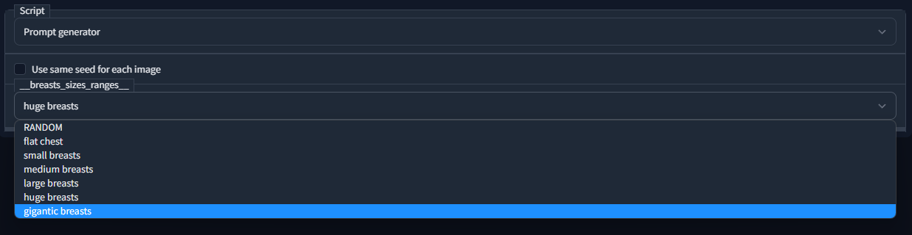

# Stable diffusion prompt generator
A prompt generator based on wildcards and dynamic prompts


based on: https://github.com/jtkelm2/stable-diffusion-webui-1/blob/master/scripts/wildcards.py
and https://github.com/adieyal/sd-dynamic-prompting

This version iterates on both these concepts by merging them and allowing for recursive wildcards

Wildcards work as expected where ```__clothes_full__``` gets replaced by 1 line from the ```wildcards\clothes_full.txt``` file. The difference is however that each wildcard file can load other wildcard files with the same syntax.

Dynamic prompts are slightly different and do not support the $$ syntax to select multiple options from a list. It does however allows you to choose the percentage change an option gets chosen.
ex: ```{25% a |25%b|c}``` will select ```a``` 25% of the time ```b``` 25% of the time and ```c``` 50% of the time.

These options can be nested with wildcards containing dynamic prompts and dynamic prompts containing wildcards both work.

## Configuration

The prompt generation allows you to specify configurable wildcard by adding them to the configuration.txt file.
As an example in this repo breast sizes are configurable:

This makes it easy to switch between different styles or prompts defined in the wildcard files.

To update what items are selectable add it to the configuration.txt file and reload scripts and ui from the settings menu

## Template syntax

### Dynamic prompts

Using this script, the prompt:

	A {house|apartment|lodge|cottage} in {summer|winter|autumn|spring} by {artist1|artist2|artist3}

Will generate any of the following prompts:

- A **house** in **summer** by **artist1**
- A **lodge** in **autumn** by **artist3**
- A **cottage** in **winter** by **artist2**
- ...

#### Weighting prompt options
The scripts allows you to weigh one or multiple options more / less heavily than others
	
    A {75%house|apartment|lodge|}
will select house 75% of the time, and the other options 12.5% of the time. percentages can be given per options like so:

    A {10%house|20%apartment|lodge}
Will select **house** 10% of the time **apartment** 20% of the time and **lodge** 70% of the time.

### Wildcards
Wildcards look like the following:
    
	__file__
this will try to read the file in the wildcards directory

	__directory\file__
will read the file from wildcards\directory. Multiple nested directories are supported for organisation

### Combining

Combining the 2 options is as simple as:

    {25%__houses__|__apartments__}
This will select from the **houses** wildcard 25% of the time and **apartments** 75% of the time
